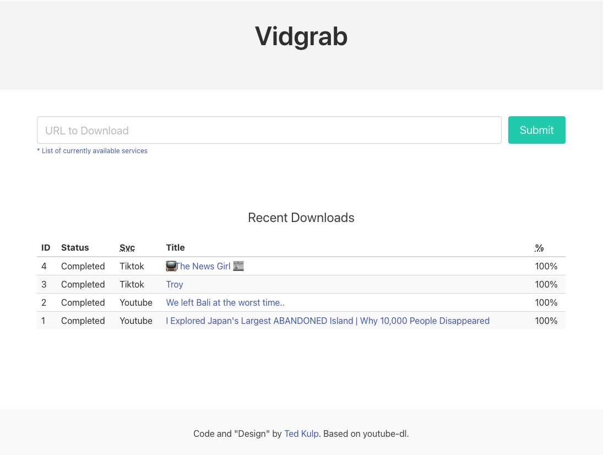

[](https://hub.docker.com/r/tedkulp/vidgrab/)
[](https://hub.docker.com/r/tedkulp/vidgrab/)
[](https://raw.githubusercontent.com/tedkulp/vidgrab/master/LICENSE)

# Vidgrab

Simple web interface to download videos with [youtube-dl](https://github.com/ytdl-org/youtube-dl) and store them on your server. Written in Typescript using [nest.js](https://nestjs.com).



## Setup

Vidgrab was written assuming that Docker would be used to deploy it.  It requires redis for it's queuing functionality.

### Docker CLI

```shell
docker run -d --name vidgrab -E FILE_DIR=/vidgrab -v /vidgrab:/vidgrab -p 3000:3000 tedkulp/vidgrab
```

### Docker Compose

There is an example docker-compose.yml file [included](https://raw.githubusercontent.com/tedkulp/vidgrab/master/docker-compose.yml) in the repo.  Use that directly to get a site running on port 3000 or modify to taste.

### Environment Variables

| Name       | Default Value | Description                         |
| ---------- | ------------- | ----------------------------------- |
| REDIS_HOST | localhost     | Hostname of the redis server        |
| REDIS_PORT | 6379          | Port to connect to for redis server |
| FILE_DIR   | /tmp          | Directory to store downloads        |

## License

This software is available under the [MIT License](https://opensource.org/licenses/MIT).
